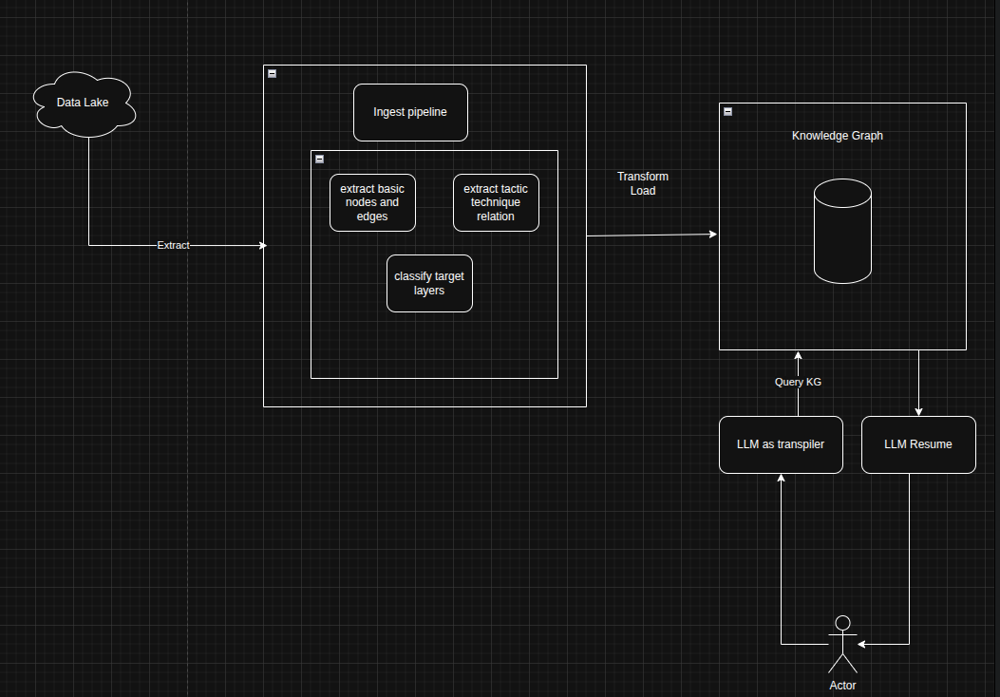

# Voyverse MITRE ATLAS Knowledge Graph

This project implements a **machine-reasonable Knowledge Graph (KG)** of the **MITRE ATLAS** framework. Designed for security auditors and engineers, it provides a verifiable grounding source for AI threat modeling, moving beyond "black-box" LLM responses to provide architecturally-aware security insights.

---

## 🏗 System Architecture

The system follows a three-stage lifecycle: **Ingest**, **Store**, and **Reason**. This architecture is designed to transform unstructured security taxonomies into a structured substrate that can answer complex queries about AI attack surfaces.

### 1. The Ingest Pipeline (L1)
This stage handles the extraction and refinement of raw security data to ensure graph integrity and eliminate noise.

*   **Data Lake:** The source of truth, containing official **STIX 2.1 JSON** data from the MITRE ATLAS repository. This includes 16 tactics, 84 techniques, and 42 real-world case studies.
*   **Basic Node & Edge Extraction:** The pipeline parses raw STIX objects into a formal schema:
    *   `x-mitre-tactic` $\rightarrow$ **Tactic**
    *   `attack-pattern` $\rightarrow$ **Technique**
    *   `course-of-action` $\rightarrow$ **Mitigation**.
*   **Tactic-Technique Relation:** Uses the `kill_chain_phases` property to create explicit `[:ACHIEVES]` relationships, mapping the "How" (Technique) to the "Why" (Tactic).
*   **Target Layer Classification:** Following the **STRIDE-AI** framework, an LLM-driven refinement step analyzes technique descriptions to map them to one of five architectural layers: **User Interface, Application, Model, Infrastructure, or Data Sources**.

### 2. The Knowledge Graph (L2)
The storage engine preserves the symbolic relationships required for multi-hop reasoning.

*   **Storage Engine:** Implemented as a **Property Graph** (e.g., Neo4j). Unlike a vector-only database, this preserves discrete `subject-relation-object` triplets, preventing hallucinations and enabling exact pathfinding.
*   **Ontology-Aware Refinement:** Inspired by the **Wikontic** pipeline, the graph enforces domain-range constraints. It uses **alias-aware deduplication** to merge redundant terms (e.g., "Jailbreaking" and "Prompt Injection") into canonical IDs, keeping the graph compact and well-connected.

### 3. The Reasoning Interface (L3)
This layer allows human actors (auditors) to interact with the graph through natural language.

*   **LLM as Transpiler:** To ensure answers are **grounded in the graph**, the system does not allow the LLM to answer from its weights. Instead, the LLM acts as a transpiler, converting natural language into structured queries (like **Cypher**).
*   **Query KG:** The transpiled query is executed against the database, retrieving only the factual triplets that exist in the ATLAS/STRIDE schema.
*   **LLM Resume (Synthesizer):** The retrieved triplets are passed back to the LLM to generate a final response. Crucially, this output includes an **auditable proof trail**—a record of every node and relationship traversed—satisfying the transparency requirements of **EU AI Act Articles 13 and 14**.

---

## 🛡 Modeling Choices & Defense

*   **Architectural Grounding:** By integrating **STRIDE-AI layers**, the graph can reason about "inference paths" and "mitigation ownership," which are not explicitly labeled in the raw MITRE data.
*   **Computational Compliance:** The system is built to act as an **"Inspector"** within a closed-loop compliance framework, identifying risks that a software "Mechanic" could eventually repair.
*   **Uncertainty Handling:** The architecture is designed to eventually support **T-Norm operators** (e.g., Gödel or Product) to aggregate probabilistic risk scores across multiple conjunctive conditions in the EU AI Act.
